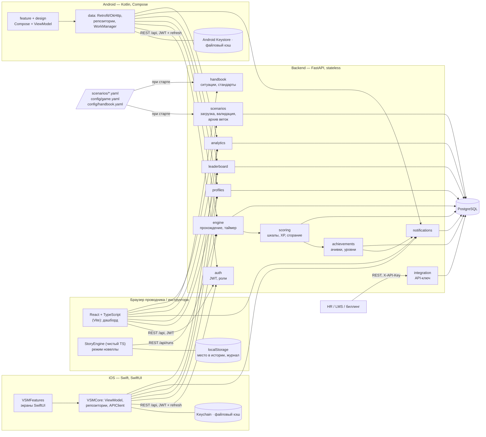
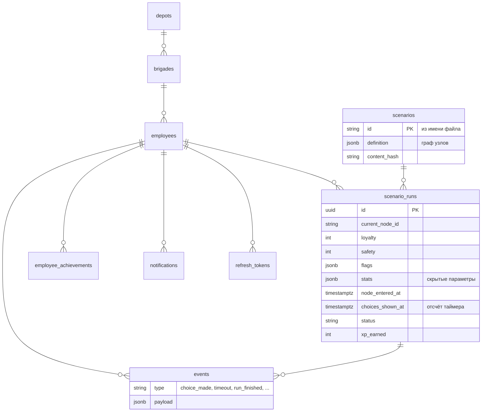
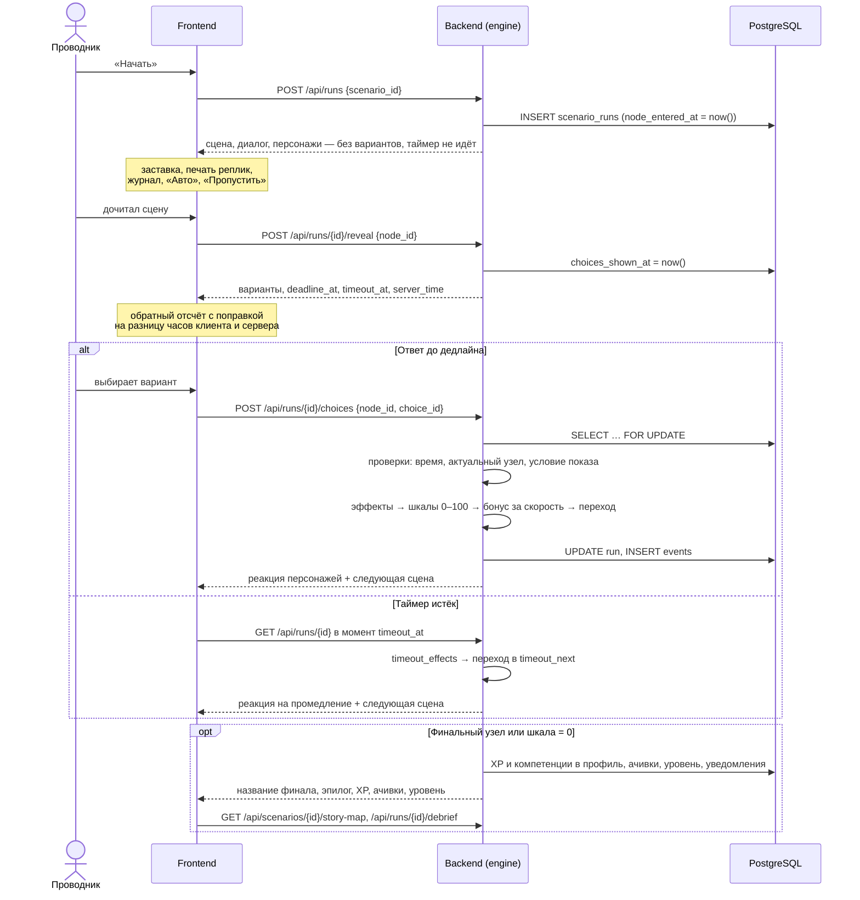

# Архитектура

## Компоненты

**Frontend** — одностраничное приложение. Обращается к относительному адресу `/api`, который Vite
проксирует на backend, поэтому CORS не нужен. Режим визуальной новеллы — отдельный движок
`frontend/src/story/StoryEngine.ts` на чистом TypeScript без React: очередь реплик, печать текста, смена сцен,
журнал, автопрокрутка, пропуск виденного, сохранение места в localStorage. React-компоненты только
подписываются на его состояние и рисуют сцену. Что происходит в истории, решает сервер.

**Мобильные приложения** — нативные: iOS на Swift/SwiftUI, Android на Kotlin/Jetpack Compose, без WebView.
Интерфейс перенесён с сайта один к одному: те же токены, шрифт Manrope, компоненты, ассеты (экспорт из
React-компонентов, `tools/mobile-assets`) и движок новеллы — порт `StoryEngine.ts`. Итог сверки —
[FINAL_UI_AUDIT.md](FINAL_UI_AUDIT.md). Устройство слоёв одинаковое:

| Слой | iOS (`ios/VSMKit`) | Android (`android/app`) |
|------|--------------------|-------------------------|
| Дизайн-система | `VSMFeatures/Design` (токены, Manrope, компоненты, графики) | `design` (токены, Manrope, компоненты, графики) |
| Экраны и навигация | `VSMFeatures/Screens`, `Gameplay`, `Navigation` (SwiftUI) | `feature/*`, `navigation` (Compose) |
| Движок новеллы | `VSMCore/Domain/StoryEngine.swift` | `domain/story/StoryEngine.kt` |
| Состояние экранов | `VSMCore/Presentation/*ViewModel.swift` (`@Observable`) | `feature/*/…ViewModel.kt` (`StateFlow`, Hilt) |
| Данные | `Data/Repositories`: сеть → кэш | `data/repository`: сеть → кэш |
| Сеть | `Networking/APIClient`, `TokenRefresher` (actor) | Retrofit + OkHttp, `TokenAuthenticator` |
| Секреты | `Security/KeychainTokenStore` | `security/KeystoreTokenStore` (AES-GCM) |
| Уведомления | `.backgroundTask(.appRefresh)` → `UNUserNotificationCenter` | `WorkManager` → `NotificationManager` |
| Внедрение зависимостей | `AppContainer` (через init) | Hilt (`di/AppModule.kt`) |

Бизнес-логики в клиентах нет: они показывают состояние сервера и отправляют действия. Отдельного «мобильного API»
тоже нет — это те же эндпоинты, что у веб-клиента, плюс обновление сессии refresh-токеном.

**Backend** не хранит состояния в памяти: прохождение, таймер, шкалы и флаги лежат в строке
`scenario_runs`. Любую копию backend можно перезапустить или добавить за балансировщиком.
Где могут столкнуться несколько копий, это решено средствами PostgreSQL:

| Ситуация | Решение |
|----------|---------|
| Два ответа на один шаг одновременно | `SELECT … FOR UPDATE` строки прохождения |
| Два финиша одного сотрудника одновременно | блокировка строки сотрудника при начислении XP |
| Две копии загружают сценарии при старте | `INSERT … ON CONFLICT DO UPDATE` |
| Две копии создают демо-данные | `pg_advisory_xact_lock` |
| Две копии сжигают баллы одному сотруднику | `FOR UPDATE SKIP LOCKED` |
| Разные часы на серверах | время берётся из БД: `now()` |

**Storage** — PostgreSQL. Граф сценария хранится целиком в JSONB (файл → строка один к одному),
журнал действий — в таблице `events`.

## Модули backend

| Модуль | Ответственность |
|--------|-----------------|
| `profiles` | депо, бригады, сотрудники; `GET /api/profile` |
| `scenarios` | формат новеллы (Pydantic → JSON-схема), валидатор графа и сцен, загрузка файлов в БД, каталог, архив веток |
| `handbook` | справочник из материалов кейсодержателя: 51 ситуация, ролевая модель, классы обслуживания, стандарты |
| `engine` | старт, показ вариантов (reveal), выбор, условия по шкалам, скрытым параметрам и флагам, эффекты, реакции, серверный таймер, финал, разбор |
| `scoring` | границы шкал 0–100, XP, бонус за скорость, челлендж недели, сгорание баллов |
| `achievements` | уровни по порогам XP, правила ачивок из конфига |
| `leaderboard` | рейтинг: бригада / депо / компания × неделя / месяц / всё время |
| `notifications` | уведомления внутри приложения, защита от дублей |
| `analytics` | прогресс, компетенции, доля завершённых, время решения, типичные ошибки, рекомендация; журнал событий, клиентские события |
| `integration` | API для HR, LMS и биллинга под API-ключом |
| `auth` | вход, JWT, refresh-токены с ротацией, лимит неудачных входов, роли «проводник» и «инструктор» |

Все правила игры — веса, пороги, ачивки, сроки — лежат в `backend/config/game.yaml`, а не в коде.
Сквозные части: `app/observability.py` — JSON-журнал с `request_id` и ответ `500 internal_error` без деталей;
`app/errors.py` — единый формат ошибок.

## Данные

### Сущности брифа и где они хранятся

| Сущность | Где |
|----------|-----|
| User, EmployeeProfile | `employees` (ФИО, табельный номер, роль, XP, `competence_points`, последняя активность) |
| Team, Depot, Company | `brigades`, `depots`; компания — все депо |
| Scenario, ScenarioNode, ScenarioChoice, ScenarioCondition, ScenarioOutcome | граф в `scenarios.definition` (JSONB) из YAML: `nodes[].choices[]`, `condition`, `effects`, `next`, `outcome`; схема — `app/scenarios/schema.py` |
| ScenarioSession | `scenario_runs`: текущий узел, шкалы, флаги, скрытые параметры, метки таймера, итог |
| ScenarioAction, AnalyticsEvent | `events`: `choice_made`, `timeout`, `run_finished`, клиентские события |
| PassengerLoyalty, SafetyRating | `scenario_runs.loyalty`, `scenario_runs.safety` (0–100) |
| Competency, CompetencyScore | коды и названия — `config/game.yaml: competences`; очки — `employees.competence_points`, по прохождению — `scenario_runs.competence_points` |
| Achievement, UserAchievement | правила — `config/game.yaml: achievements`; выданные — `employee_achievements` (уникально по сотруднику и коду) |
| Leaderboard | не хранится: SQL по `scenario_runs.xp_earned` за период — всегда актуален |
| Notification | `notifications` (уникально по `dedup_key`) |
| UserProgress | уровень считается из XP по порогам `config/game.yaml: levels`; прогресс по неделям — из `scenario_runs` |
| Сессия устройства | `refresh_tokens` |

## Прохождение сценария

Клиентский таймер только показывает остаток. Решает сервер: ответ позже
`choices_shown_at + timer_seconds` (плюс 1 секунда на задержку сети, настраивается)
отклоняется с кодом `time_expired`, а таймаут применяется при любом обращении к прохождению.
Таймер стартует, когда проводник дочитал сцену и увидел варианты: время на чтение диалога не штрафуется,
а варианты до этого момента сервер не отдаёт — подглядеть их, не запустив таймер, нельзя.
Ответ без показа вариантов отклоняется с кодом `choices_not_shown`.
