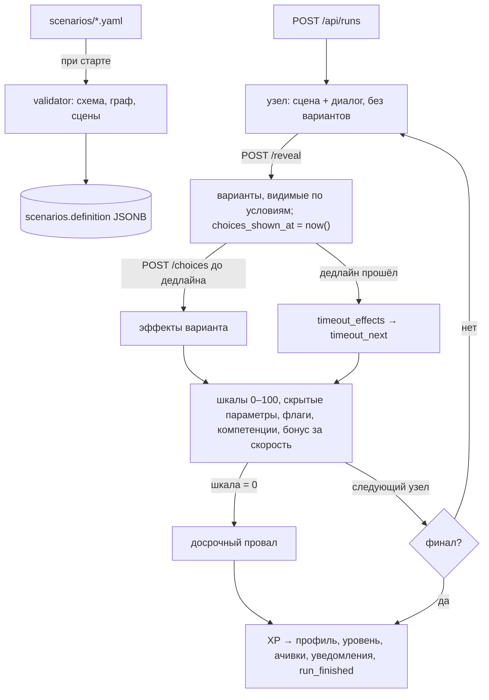

# Сценарный движок и игровая механика

Движок целиком на сервере (`backend/app/engine/service.py`). Клиенты — веб, iOS, Android — только показывают
состояние и отправляют действия: исход шага, таймер, шкалы, XP и ачивки считает backend. Поэтому поменять
развилку или правило можно в одном месте, и оно сразу действует во всех клиентах.

Формат файла сценария и «как добавить развилку за 5 минут» — в [SCENARIOS.md](SCENARIOS.md).

## Устройство

Каждый вариант ответа меняет две шкалы по-разному: например, «пересадить пассажира силой» поднимает безопасность
и роняет лояльность. Скрытые параметры (`stats`: доверие, напряжение) и флаги открывают или закрывают варианты
на следующих шагах. Истечение таймера — отдельная ветка со своими последствиями, а не «пропуск хода».

## Где что в коде — ответы на контрольные вопросы

| # | Вопрос | Ответ |
|---|--------|-------|
| 1 | Где Scenario Engine? | `backend/app/engine/service.py`: `start_run`, `reveal_choices`, `choose`, `get_run` |
| 2 | Где ветвление? | `Choice.next` и `Node.timeout_next` в `scenarios/schema.py`; переход — `engine/service.py: _advance` |
| 3 | Где условия? | разбор и проверка — `scenarios/conditions.py: parse_condition, is_satisfied`; применение — `engine/service.py: visible_choices` |
| 4 | Где таймер? | отсчёт от `ScenarioRun.choices_shown_at`; дедлайн — `_deadline`; просрочка — `_resolve_timeouts` → `apply_timeout`; ответ после дедлайна — `409 time_expired` в `choose`. Клиенты: iOS `ServerClock`, Android `core/ServerClock.kt` — только показ |
| 5 | Где меняется лояльность? | `engine/service.py: _apply` (эффекты варианта или таймаута) → `scoring/service.py: clamp_scale` |
| 6 | Где меняется безопасность? | там же, `_apply`; провал при нуле — `_advance` |
| 7 | Где очки компетенций? | `_apply` копит в `ScenarioRun.competence_points`; бонус за скорость — `scoring.fast_answer_bonus`; в профиль — `scoring.award` при финале |
| 8 | Где XP? | `scoring/service.py: calculate_xp` (итог × сложность + шкалы × веса из `config/game.yaml`) и `weekly_challenge_bonus`; вызывается в `engine/service.py: _finish` |
| 9 | Где ачивки? | `achievements/service.py: evaluate`, правила — `config/game.yaml: achievements` |
| 10 | Где обновляется рейтинг? | отдельного обновления нет: `leaderboard/router.py: leaderboard` считает SQL-запросом по `scenario_runs.xp_earned` за период — рейтинг всегда актуален, клиент его не вычисляет |
| 11 | Где разбор (feedback)? | `engine/debrief.py: build_debrief` — по журналу `events`: решение, пояснение, дельты шкал, лучший вариант, стандарт ситуации |
| 12 | Где аналитика? | запись — `engine/service.py: _log` и `POST /api/analytics/events`; выводы — `analytics/service.py: build_analytics` |
| 13 | Где офлайн? | iOS `RemoteTrainerRepository.cached` + `FileResponseCache`; Android `RemoteTrainerRepository.cached` + `FileResponseCache`. Прохождение — только онлайн, см. ниже |
| 14 | Где auth token? | iOS — Keychain (`KeychainTokenStore`, `AfterFirstUnlockThisDeviceOnly`); Android — AES-GCM с ключом в Android Keystore (`KeystoreTokenStore`); веб — `localStorage` (см. LIMITATIONS) |
| 15 | Где серверная валидация? | тела запросов — Pydantic-модели роутеров; действия — проверки в `choose` / `reveal_choices` (статус, актуальный узел, показаны ли варианты, видим ли вариант, не истёк ли таймер); файлы сценариев — `scenarios/validator.py` |
| 16 | Где документирован API? | [API.md](API.md), [openapi.yaml](openapi.yaml), Swagger `/api/docs` |
| 17 | Как добавить сценарий без правки ядра? | положить `backend/scenarios/<id>.yaml`, проверить `python -m app.scenarios.validator scenarios/<id>.yaml`, перезапустить backend. Клиентам ничего менять не нужно |
| 18 | Как изменить правило очков? | `backend/config/game.yaml` (веса XP, бонус за скорость, пороги уровней, ачивки, сгорание) → перезапуск backend |
| 19 | Как восстановить прерванный сценарий? | состояние целиком в строке `scenario_runs`; `POST /api/runs` с тем же `scenario_id` возвращает незавершённое прохождение, `GET /api/runs/{id}` применяет истёкший за это время таймер. Клиенты помнят `run_id` (`ActiveRunStore`) и показывают «Продолжить» |
| 20 | Как не начислить награду дважды? | `SELECT … FOR UPDATE` строки прохождения (`_lock_run`): второй ответ на тот же шаг получает `409 stale_node`; XP начисляется один раз при переходе в финальный статус; ачивка — уникальный ключ `(employee_id, code)` в `employee_achievements`; уведомления — `(employee_id, dedup_key)`; клиенты блокируют повторное нажатие фазой `submitting` |

## Почему прохождение не работает офлайн

Таймер — часть механики: ответ, пришедший позже дедлайна, сервер обязан отклонить, иначе таймер станет
декоративным. Если бы клиент копил решения без сети и отправлял потом, сервер не мог бы отличить честный ответ
от ответа «после подсказки». Поэтому при обрыве связи клиент остаётся на шаге и позволяет отправить тот же ответ
ещё раз; если первый ответ всё-таки дошёл, повтор получит `stale_node`, и клиент перечитает состояние.
Всё остальное (профиль, каталог, рейтинг, уведомления, аналитика) офлайн показывается из кэша с пометкой даты.

## Порядок действий клиента

1. `POST /api/runs {scenario_id}` — сцена и диалог; вариантов нет, таймер не идёт (время на чтение не штрафуется).
2. `POST /api/runs/{id}/reveal {node_id}` — варианты, `deadline_at`, `timeout_at`, `server_time`.
3. Обратный отсчёт по `server_time` (поправка на часы телефона).
4. `POST /api/runs/{id}/choices {node_id, choice_id}` — реакция персонажей (`last_steps`), новые шкалы, следующая сцена.
   Если отсчёт дошёл до `timeout_at`, клиент делает `GET /api/runs/{id}` — сервер применяет таймаут.
5. На финале — `final`, `new_achievements`, `level_up`; затем `GET /api/runs/{id}/debrief`.

Реализации: веб — `frontend/src/story/StoryEngine.ts`, iOS — `VSMCore/Presentation/ScenarioPlayerViewModel.swift`,
Android — `presentation/player/PlayerViewModel.kt`. Сценарии переходов (двойное нажатие, ответ после таймера,
обрыв связи, таймаут) покрыты тестами во всех трёх: `backend/tests/test_timer.py`, `ScenarioPlayerTests.swift`,
`PlayerViewModelTest.kt`.
