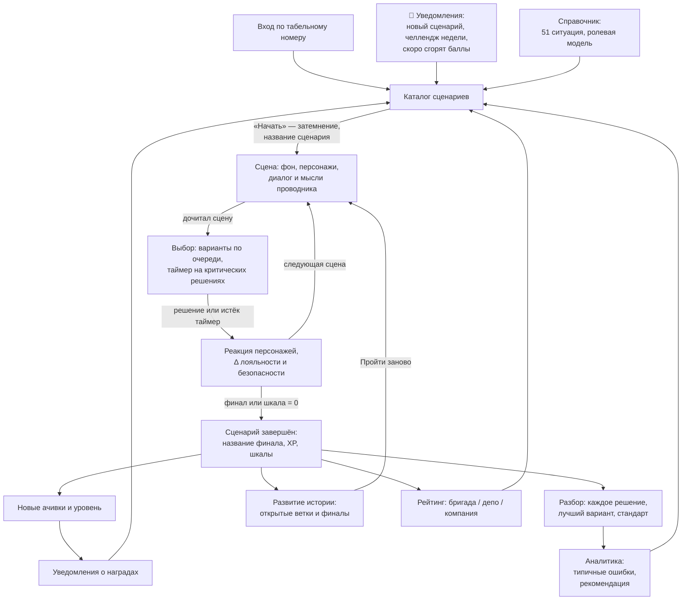
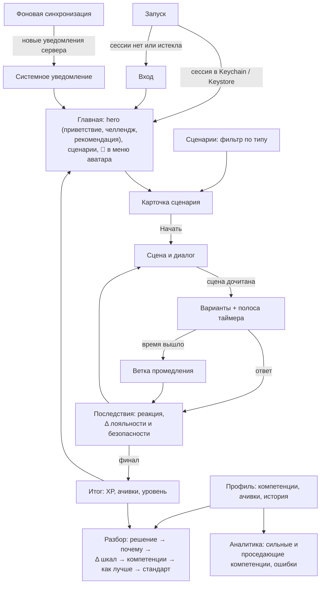

# Путь проводника

Замкнутый цикл: **история → решения → очки → достижения → рейтинг → уведомление → новая история**.

## Шаг за шагом

1. **Вход.** Табельный номер и пароль. Роль определяет меню: инструктор видит раздел «Команда».
2. **Уведомления** (колокольчик, опрос раз в 30 секунд): новые сценарии, челлендж недели с бонусом XP,
   предупреждение за 2 дня до сгорания баллов, сгоревшие баллы, ачивки, новый уровень.
3. **Каталог.** Категория, класс обслуживания (первый, бизнес, комфорт, стандарт), маршрут, сложность,
   число финалов. На странице сценария — какие ситуации из справочника он отрабатывает.
4. **Вход в историю.** Дашборд уходит в затемнение, на тёмном экране появляется название сценария,
   затем проявляется первая сцена. Навигации дашборда в режиме новеллы нет.
5. **Сцена.** Фон — фото салона и поезда из материалов кейсодержателя или нарисованный тамбур, бистро,
   служебное купе; персонажи появляются плавно, говорящий выделен, остальные приглушены, выражения лиц
   меняются по ходу реплик. Текст печатается постепенно; клик по сцене или «Далее» мгновенно допечатывает
   реплику. Мысли проводника — курсивом, слова рассказчика — отдельным стилем. Говорящий персонаж слегка
   покачивается, на смену эмоции реагирует движением; уставшие и расстроенные персонажи вздыхают.
   Фоном тихо играет музыка — её и звуки можно выключить кнопкой «Звук».
6. **Инструменты.** «История» — журнал всех прочитанных реплик и решений; «Авто» — автопрокрутка;
   «Пропустить» — пропуск сцен, уже виденных в прошлых прохождениях. Клавиши: пробел/Enter — далее,
   1–3 — выбор варианта. Вверху — точки прогресса истории без карты будущих развилок и две шкалы из ТЗ;
   после решения на шкалах видно, как они изменились.
7. **Выбор.** Кнопка «Далее» исчезает, варианты появляются по очереди. Правильный ответ не подсказывается.
   На критических решениях идёт серверный таймер — он стартует в момент показа вариантов, поэтому чтение
   сцены не отнимает время. Промедление — тоже решение: история продолжается без вас.
8. **Последствия.** Персонажи реагируют на решение, история уходит в другую ветку; скрытые параметры
   (доверие, напряжение) и флаги открывают варианты, которых при другом поведении не было.
9. **Финал.** «Сценарий завершён», название финала, к чему привели решения, XP, итоговые шкалы,
   компетенции, число открытых финалов, ачивки и уровень. Дальше — «Посмотреть путь», «Разбор решений»,
   «Пройти заново», «Вернуться к сценариям».
10. **Развитие истории.** Дерево развилок: исследованные варианты с текстом, закрытые — «Ветка не
    исследована», неоткрытые финалы — без названий. Карту строит сервер, поэтому закрытое нельзя
    подсмотреть даже в ответе API.
11. **Разбор.** График шкал; по каждому шагу — выбор, его влияние, пояснение и лучший вариант;
    блок «Как действовать по стандарту» — реакция и фразы из «Ситуаций на борту» для ситуаций сценария.
12. **Сохранение.** Место в истории, журнал и выбор хранятся в браузере (localStorage): вернувшись,
    проводник продолжает с той же реплики. Решения, шкалы и таймер — на сервере.
13. **Профиль, рейтинг, аналитика, справочник** — как и раньше: уровень и компетенции, рейтинг по бригаде,
    депо и компании, типичные ошибки и рекомендация сценария, справочник с поиском по 51 ситуации.
14. **Сгорание.** Если 7 дней (настраивается) не проходить сценарии, сгорает часть XP.

## Путь инструктора

«Команда» → список проводников своего депо (уровень, XP, последняя активность, проседающая
компетенция) → аналитика конкретного проводника: те же выводы и рекомендация.

## Мобильные приложения (iOS и Android)

Тот же цикл, что в вебе, в нативном интерфейсе каждой платформы: вкладки «Главная», «Сценарии», «Рейтинг»,
«Профиль»; сценарий открывается поверх вкладок на весь экран.

- **Закрыли приложение посреди сценария.** Состояние на сервере; «Начать сценарий» возвращает то же прохождение
  с реплики, на которой остановились, а если таймер за это время истёк, сервер уже применил последствия.
- **Пропала сеть.** Экраны показывают сохранённые данные с пометкой «Нет связи. Данные от …». Ответ в сценарии
  не теряется: остаёмся на шаге и отправляем ещё раз; если первый ответ дошёл, клиент получит актуальную сцену.
- **Двойное нажатие.** Пока ответ в пути, варианты заблокированы; сервер дополнительно отклонит повтор.
- **Истекла сессия.** Клиент молча обновляет её refresh-токеном; если это невозможно — экран входа
  с объяснением, данные прежнего сотрудника удаляются с устройства.
- **Уведомления.** Раз в ~15 минут (как позволит система) приложение забирает новые уведомления backend —
  новый сценарий, челлендж, сгорающие баллы, ачивка — и показывает их системным баннером один раз.
