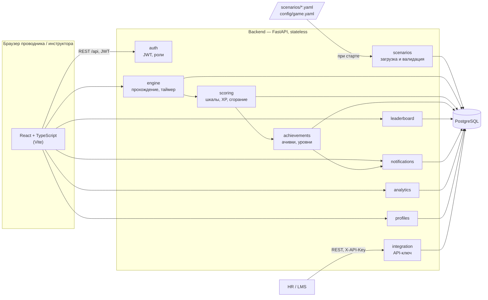
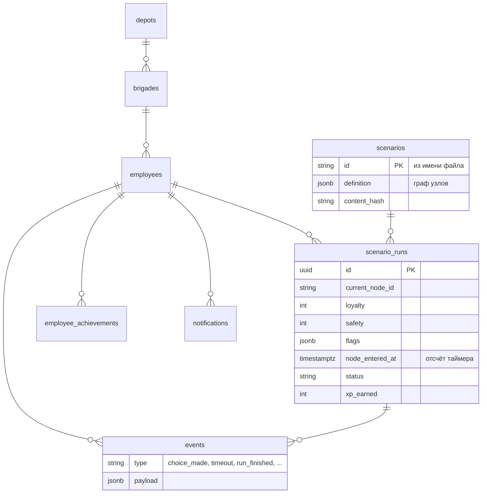
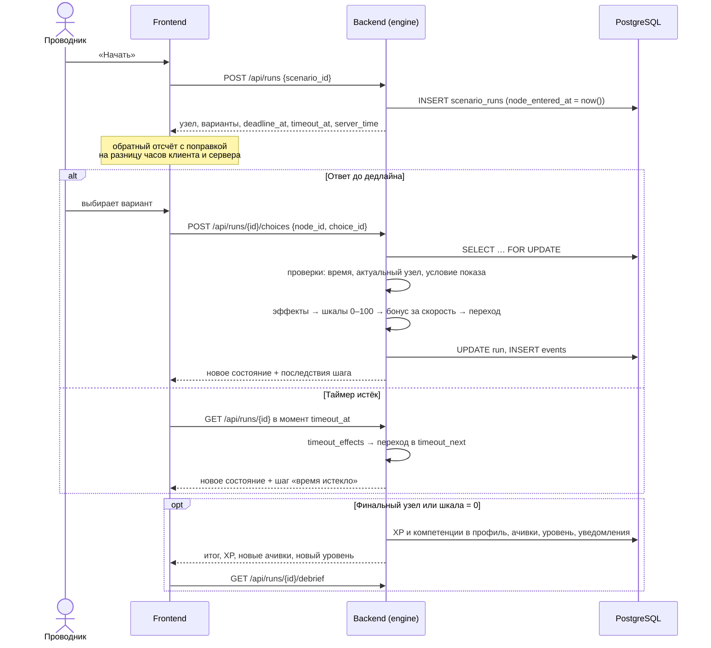

# Архитектура

## Компоненты

**Frontend** — одностраничное приложение. Обращается к относительному адресу `/api`, который Vite
проксирует на backend, поэтому CORS не нужен.

**Backend** не хранит состояния в памяти: прохождение, таймер, шкалы и флаги лежат в строке
`scenario_runs`. Любую копию backend можно перезапустить или добавить за балансировщиком.
Где могут столкнуться несколько копий, это решено средствами PostgreSQL:

| Ситуация | Решение |
|----------|---------|
| Два ответа на один шаг одновременно | `SELECT … FOR UPDATE` строки прохождения |
| Два финиша одного сотрудника одновременно | блокировка строки сотрудника при начислении XP |
| Две копии загружают сценарии при старте | `INSERT … ON CONFLICT DO UPDATE` |
| Две копии создают демо-данные | `pg_advisory_xact_lock` |
| Две копии сжигают баллы одному сотруднику | `FOR UPDATE SKIP LOCKED` |
| Разные часы на серверах | время берётся из БД: `now()` |

**Storage** — PostgreSQL. Граф сценария хранится целиком в JSONB (файл → строка один к одному),
журнал действий — в таблице `events`.

## Модули backend

| Модуль | Ответственность |
|--------|-----------------|
| `profiles` | депо, бригады, сотрудники; `GET /api/profile` |
| `scenarios` | формат (Pydantic → JSON-схема), валидатор графа, загрузка файлов в БД, каталог |
| `engine` | старт, выбор, условия, эффекты, переходы, серверный таймер, финал, разбор |
| `scoring` | границы шкал 0–100, XP, бонус за скорость, челлендж недели, сгорание баллов |
| `achievements` | уровни по порогам XP, правила ачивок из конфига |
| `leaderboard` | рейтинг: бригада / депо / компания × неделя / месяц / всё время |
| `notifications` | уведомления внутри приложения, защита от дублей |
| `analytics` | прогресс, компетенции, типичные ошибки, рекомендация; журнал событий |
| `integration` | API для HR и LMS под API-ключом |
| `auth` | вход, JWT, роли «проводник» и «инструктор» |

Все правила игры — веса, пороги, ачивки, сроки — лежат в `backend/config/game.yaml`, а не в коде.

## Данные

## Прохождение сценария

Клиентский таймер только показывает остаток. Решает сервер: ответ позже
`node_entered_at + timer_seconds` (плюс 1 секунда на задержку сети, настраивается)
отклоняется с кодом `time_expired`, а таймаут применяется при любом обращении к прохождению.
Если проводник пропустил несколько узлов подряд, таймауты применяются по цепочке
от точных моментов дедлайнов.
