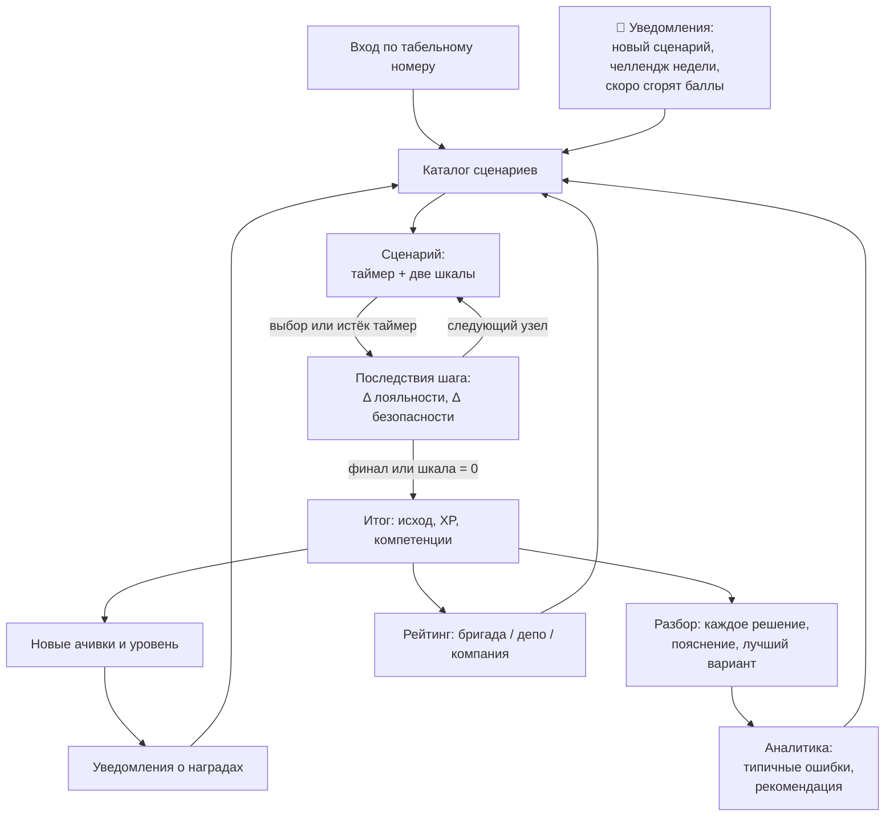

# Путь проводника

Замкнутый цикл: **действие → очки → достижения → рейтинг → уведомление → новое действие**.

## Шаг за шагом

1. **Вход.** Табельный номер и пароль. Роль определяет меню: инструктор видит раздел «Команда».
2. **Уведомления** (колокольчик, обновляется раз в 30 секунд): новые сценарии, челлендж недели
   с бонусом XP, предупреждение за 2 дня до сгорания баллов, сгоревшие баллы, ачивки, новый уровень.
3. **Каталог.** Категория, сложность, маршрут, класс обслуживания; демо-контент помечен.
4. **Прохождение.** Вверху всегда видны обе шкалы и таймер; при остатке меньше 5 секунд
   таймер становится красным. После каждого шага сразу видно, как решение изменило шкалы.
   Если время вышло, срабатывает переход «по таймауту» со штрафом. Шкала на нуле — досрочный провал.
5. **Итог.** Исход (успех / частичный / провал), XP, очки компетенций, новые ачивки и уровень.
6. **Разбор.** График траектории шкал; по каждому шагу — выбор, его влияние, пояснение и
   лучший вариант в этой точке; сводка: доля лучших решений, таймауты, среднее время решения.
7. **Профиль.** Уровень и прогресс до следующего, радар компетенций, все ачивки (полученные и цели),
   история прохождений со ссылками на разбор.
8. **Рейтинг.** Бригада, депо, компания × неделя, месяц, всё время; своя строка выделена,
   даже если она ниже топ-20.
9. **Аналитика.** XP по неделям, статистика по типам ситуаций, сильные и проседающие компетенции,
   типичные ошибки текстом и рекомендация сценария, который закрывает пробел.
10. **Сгорание.** Если N дней (в конфиге — 7) не проходить сценарии, сгорает часть XP —
    это мотивирует возвращаться к тренировкам.

## Путь инструктора

«Команда» → список проводников своего депо (уровень, XP, последняя активность, проседающая
компетенция) → аналитика конкретного проводника: те же выводы и рекомендация.
